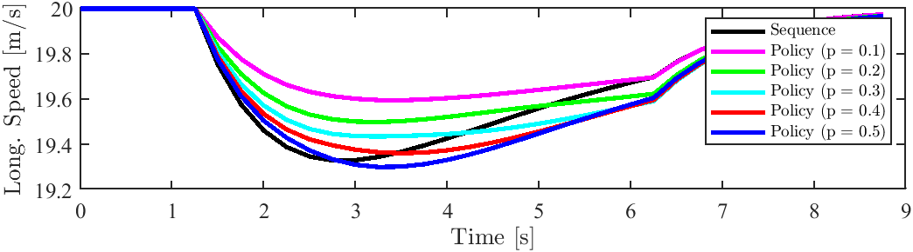

# Interaction-Aware Motion Planning for Autonomous Vehicles with Multi-Modal Obstacle Uncertainty Predictions

(For any questions please contact jian.zhou@liu.se or zjzb1212@qq.com)
## Basic information
> The paper "Interaction-Aware Motion Planning for Autonomous Vehicles with Multi-Modal Obstacle Uncertainty Predictions" by Jian Zhou, Björn Olofsson, and Erik Frisk, has been accepted by IEEE Transactions on Intelligent Vehicles.

> The authors come from the Department of Electrical Engineering, Linköping University, Sweden, and Department of Automatic Control, Lund University, Sweden.

> See **'Implementatation'** the code for the method proposed in the paper. See **'policy-vs-sequence-optimization'** the implementation for the comparison between **Sequence-based Optimization** and **Policy-based Optimization** [1], [2].

## Prerequisite
> You need to install CasADi (https://web.casadi.org/) for running both the Python code and MATLAB code. 

> The optimization problem is solved using linear solver ma57 (https://licences.stfc.ac.uk/product/coin-hsl), but you can comment out the ma57 solver in the code of you do not manage to install the HSL solvers. Then the ipopt will use the default linear solver.

> One key Python package is needed: **scikit-image 0.21.0** (https://pypi.org/project/scikit-image/).

The following will show some supplementary materials to the paper. These case studies are mentioned in the corresponding places during the paper.

### Comparison between Sequence-based and Policy-based Optimizations
The implementation is performed by MATLAB, to run the code you need to download CasADi (https://web.casadi.org/).

The scenario is designed in Fig. 1, where the SV is predicted to have both lane-changing probability and lane-keeping probability by the EV. In actuality the SV is always keeping the lane, the EV is controlled by an MPC controller which tracks a constant velocity and keeps the lane. If the SV is predicted to change the lane, the EV, being controlled by the MPC, needs to decelerate to avoid a collision with the SV over the prediction horizon.

 Fig. 1 Scenario 

We compare the results of the two methods with respect to different lane-changing probabilities of the SV. The probabilities are set manually here, while in a comprehensive motion planner, it is predicted by a motion prediction module. We set the predicted lane-changing probabilities of the SV in five different cases as below:

 Fig.2 Predicted lane-changing probability of the SV. 

According to the probability output, we get the motion-planning results of the EV:

 Fig.3 Speed of the EV. 

 Fig.4 Net acceleration of the EV. 

 Fig.5 Optimal cost of two methods. 

The computation time of the sequence-based approach with p = 0.1 to 0.5 is 0.06 s, 0.07 s, 0.05 s, 0.07 s, 0.05 s, respectively.

The computation time of the policy-based approach with p = 0.1 to 0.5 is 0.11 s, 0.12 s, 0.09 s, 0.12 s, 0.09 s, respectively.

From this case study, we can conclude that:
(1) The policy-based approach is generally less conservative than the sequence-based approach, particularly when one of the probabilities is predicted very small. (2) The policy-based approach takes a longer time to solve the problem, and it is easy to infer that the computation time increases when the number of SVs and the number of modes are increased.

### An example to illustrate why it is necessary to reformulate the OCP of the policy-based approach

It is mentioned in Remark 5.2 in the manuscript that the policy-based
approach necessitates reformulating the OCP at every time step, as the number of optimization variables of the OCP,
which depend on the prediction of obstacles, is changing. This will be illustrated by an example here.

We consider the case illustrated in Fig. 6. 

 Fig.6 Illustration of the policy-based approach with respect to the predicted modes of SV. 

In Fig. 6, we assume that the SV has two predicted modes, i.e., mode 1 and mode 2. Correspondingly, the ego vehicle (EV) has two control policies to avoid collision with each mode of the SV. The control sequences of each policy of the EV corresponding to mode 1 and mode 2 of the SV are:
$$u_{1,k}^{\rm EV} \ u_{1,k+1}^{\rm EV} \ u_{1,k+2}^{\rm EV} \ u_{1,k+3}^{\rm EV} \ u_{1,k+4}^{\rm EV}$$
and
$$u_{2,k}^{\rm EV} \ u_{2,k+1}^{\rm EV} \ u_{2,k+2}^{\rm EV} \ u_{2,k+3}^{\rm EV} \ u_{2,k+4}^{\rm EV}$$

These two control sequences should share a common portion before a time point, and then start to deviate. To enhance the safety of the policies, and also to reduce the number of redundant optimization variables, the method in [1] and [2] suggests that when the modes intersect with each other, the control actions of the corresponding policies should be equal. For example, in Fig. 6, the two policies share a control sequence before time step $k+3$ in the prediction horizon, i.e.,
$$u_{1,k}^{\rm EV}=u_{2,k}^{\rm EV}, \ u_{1,k+1}^{\rm EV}=u_{2,k+1}^{\rm EV}$$

However, due to the uncertainty in the predictions, the exact time step within the prediction horizon at which the modes start to completely separate from each other becomes uncertain. As a result, the number of optimization variables may change, necessitating the reformulation of the OCP. 

## Reference
[1] Batkovic, Ivo, et al. "A robust scenario MPC approach for uncertain multi-modal obstacles." IEEE Control Systems Letters 5.3 (2021): 947-952.

[2] Nair, Siddharth H., et al. "Stochastic mpc with multi-modal predictions for traffic intersections." 2022 IEEE 25th International Conference on Intelligent Transportation Systems (ITSC). IEEE, 2022.

